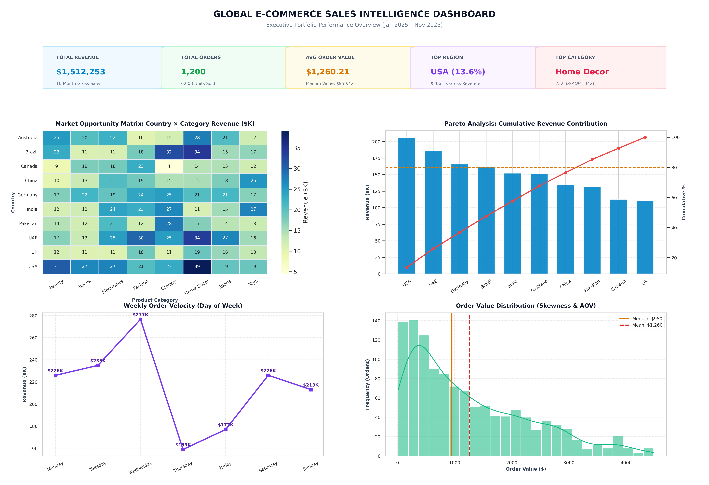

# Global E-Commerce Revenue & Portfolio Intelligence Dashboard

## 📌 Executive Summary
An end-to-end analytical study evaluating **$1.51M in gross merchandise value (GMV)** across 1,200 orders, 10 geographic regions, and 8 product categories. This project identifies core revenue drivers, assesses market concentration risks via Pareto distribution, and isolates purchasing velocity patterns.

## 📊 Executive Dashboard Preview

## 🔍 Key Findings & Business Insights
- **Revenue Drivers:** The United States ($206.1K | 13.6%) and the UAE ($185.6K | 12.3%) lead international sales performance.
- **Pareto Concentration (80/20 Rule):** 7 out of 10 international markets contribute to the initial 80% revenue benchmark, demonstrating a balanced global footprint with low single-market vulnerability.
- **Category Profitability:** Home Decor generated the highest gross volume ($232.3K) and commanded the highest Average Order Value ($1,442).
- **Weekly Demand Velocity:** Peak order value concentrates on Wednesdays ($277K), with a notable operational dip on Thursdays ($159K).
- **Pricing & Basket Skewness:** Order values exhibit positive right-skewness (Mean: $1,260.21 vs. Median: $950.42), driven by multi-unit basket orders exceeding $3,000.

## 🛠️ Tech Stack & Methods
- **Python / Pandas:** Transaction auditing, cross-tabulation matrices, time-series feature engineering.
- **Seaborn & Matplotlib (GridSpec):** Multi-tier executive dashboard engineering with KPI cards and customized dual-axis distributions.
- **Core Analytics Concepts:** Pareto analysis, price elasticity screening, descriptive skewness, cross-tab regional matrices.
